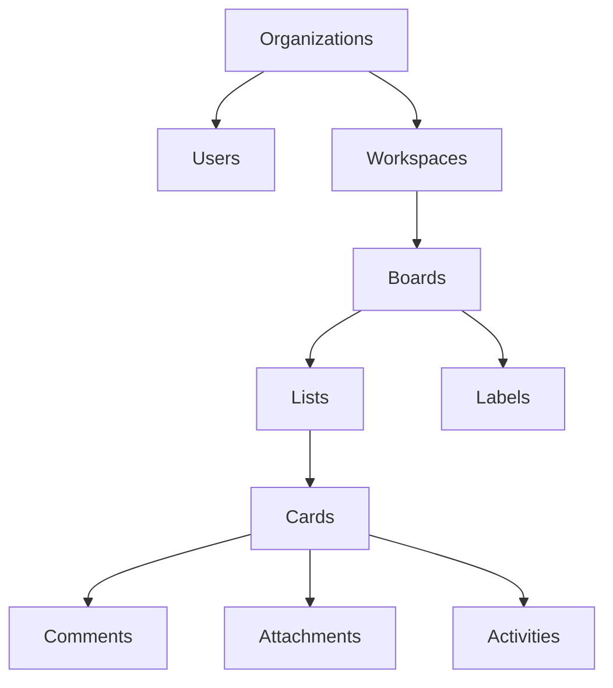

# 🔄 Guia de Migração: Frontend para Backend

Este guia apresenta os passos para migrar seu projeto BoardSync do estado local para uma arquitetura com banco de dados PostgreSQL e API REST.

## 📋 Sumário

1. [Status Atual](#status-atual)
2. [Configuração do Backend](#configuração-do-backend)
3. [Estrutura do Banco](#estrutura-do-banco)
4. [Migração dos Dados](#migração-dos-dados)
5. [Integração do Frontend](#integração-do-frontend)
6. [Próximos Passos](#próximos-passos)

## ✅ Status Atual

Seu projeto BoardSync já possui:

### ✅ Implementado
- **Schema PostgreSQL completo** (`database/schema.sql`)
- **API Backend estruturada** (`api/`)
- **Autenticação JWT**
- **Controladores principais** (Auth, Workspace, Board, Card)
- **Rotas da API**
- **Middlewares de segurança**
- **WebSocket para tempo real**
- **Sistema de logs**
- **Validação de dados**
- **Tratamento de erros**
- **Upload de arquivos**

### ⏳ Para Implementar
- Integração do frontend com API
- Migração dos dados atuais
- Testes automatizados
- Documentação completa

## 🚀 Configuração do Backend

### 1. Preparar o Ambiente

```bash
# Instalar PostgreSQL (se não tiver)
# Windows: https://www.postgresql.org/download/windows/
# macOS: brew install postgresql
# Ubuntu: sudo apt-get install postgresql

# Criar banco de dados
createdb boardsync

# Instalar dependências da API
cd api
npm install
```

### 2. Configurar Variáveis de Ambiente

```bash
# Copiar arquivo de exemplo
cp .env.example .env
```

Editar `.env` com suas configurações:

```env
# Servidor
PORT=3001
NODE_ENV=development

# Banco de dados
DB_HOST=localhost
DB_PORT=5432
DB_NAME=boardsync
DB_USER=postgres
DB_PASSWORD=sua_senha_aqui

# JWT
JWT_SECRET=sua_chave_secreta_jwt_muito_segura
JWT_EXPIRES_IN=7d

# CORS
ALLOWED_ORIGINS=http://localhost:3000,http://localhost:5173

# Rate Limiting
RATE_LIMIT_WINDOW_MS=900000
RATE_LIMIT_MAX_REQUESTS=100

# Logs
LOG_LEVEL=info

# Socket.IO
SOCKET_CORS_ORIGIN=http://localhost:3000
```

### 3. Configurar o Banco de Dados

```bash
# Executar schema SQL
psql -d boardsync -f ../database/schema.sql

# OU usar o script de setup
npm run db:setup
```

### 4. Iniciar o Servidor

```bash
# Desenvolvimento
npm run dev

# Produção
npm start
```

O servidor estará rodando em `http://localhost:3001`

## 🗄️ Estrutura do Banco

O banco de dados implementa uma arquitetura robusta e escalável:

### Tabelas Principais

- **organizations**: Multi-tenancy
- **users**: Usuários do sistema
- **workspaces**: Espaços de trabalho
- **boards**: Quadros Kanban
- **board_lists**: Listas/colunas
- **cards**: Cartões/tarefas
- **labels**: Etiquetas
- **comments**: Comentários
- **activities**: Log de atividades
- **attachments**: Anexos

### Relacionamentos



### Recursos Implementados

- **Auditoria completa**: Todas as ações são logadas
- **Soft Delete**: Dados são marcados como deletados, não removidos
- **Timestamps automáticos**: created_at e updated_at
- **UUIDs**: Identificadores únicos
- **Índices otimizados**: Performance garantida
- **Row Level Security**: Segurança a nível de linha
- **Triggers**: Automação de tarefas

## 📊 Migração dos Dados

### 1. Script de Migração

Criar `api/migrate-data.js`:

```javascript
import { db } from './src/config/database.js';
import { initialData } from '../src/data/initialData.js';
import { v4 as uuidv4 } from 'uuid';
import bcrypt from 'bcryptjs';

async function migrateData() {
  try {
    console.log('🔄 Iniciando migração dos dados...');

    // 1. Criar organização padrão
    const orgId = '550e8400-e29b-41d4-a716-446655440000';
    
    // 2. Migrar usuários
    console.log('👥 Migrando usuários...');
    for (const user of Object.values(initialData.users)) {
      const hashedPassword = await bcrypt.hash('password123', 12);
      
      await db('users').insert({
        id: user.id,
        organization_id: orgId,
        email: user.email,
        password_hash: hashedPassword,
        name: user.name,
        avatar: user.avatar,
        color: user.color,
        bg_color: user.bgColor,
        role: 'member',
        status: 'active'
      }).onConflict('id').ignore();
    }

    // 3. Criar workspace padrão
    const workspaceId = uuidv4();
    await db('workspaces').insert({
      id: workspaceId,
      organization_id: orgId,
      name: 'Projeto Principal',
      description: 'Workspace migrado do sistema anterior',
      created_by: Object.keys(initialData.users)[0]
    }).onConflict('id').ignore();

    // 4. Adicionar membros ao workspace
    for (const userId of Object.keys(initialData.users)) {
      await db('workspace_members').insert({
        id: uuidv4(),
        workspace_id: workspaceId,
        user_id: userId,
        role: 'member',
        invited_by: Object.keys(initialData.users)[0]
      }).onConflict(['workspace_id', 'user_id']).ignore();
    }

    // 5. Criar board padrão
    const boardId = uuidv4();
    await db('boards').insert({
      id: boardId,
      workspace_id: workspaceId,
      name: 'Board Principal',
      description: 'Board migrado do sistema anterior',
      created_by: Object.keys(initialData.users)[0]
    }).onConflict('id').ignore();

    // 6. Migrar colunas
    console.log('📋 Migrando listas...');
    const listMapping = {};
    for (const column of Object.values(initialData.columns)) {
      const listId = uuidv4();
      listMapping[column.id] = listId;
      
      await db('board_lists').insert({
        id: listId,
        board_id: boardId,
        name: column.title,
        position: initialData.columnOrder.indexOf(column.id) + 1
      }).onConflict('id').ignore();
    }

    // 7. Migrar labels
    console.log('🏷️ Migrando labels...');
    for (const label of Object.values(initialData.labels)) {
      await db('labels').insert({
        id: label.id,
        board_id: boardId,
        name: label.name,
        color: label.color,
        bg_color: label.bgColor
      }).onConflict('id').ignore();
    }

    // 8. Migrar cards
    console.log('📝 Migrando cards...');
    for (const column of Object.values(initialData.columns)) {
      for (let i = 0; i < column.cardIds.length; i++) {
        const cardId = column.cardIds[i];
        const card = initialData.cards[cardId];
        
        if (card) {
          const listId = listMapping[column.id];
          
          await db('cards').insert({
            id: card.id,
            list_id: listId,
            title: card.title,
            description: card.description,
            position: i + 1,
            priority: card.priority,
            category: card.category,
            parent_card_id: card.parentId,
            is_blocked: card.isBlocked,
            block_reason: card.blockReason,
            due_date: card.dueDate,
            completed_at: card.completedAt,
            created_by: card.assignedUsers?.[0] || Object.keys(initialData.users)[0]
          }).onConflict('id').ignore();

          // Migrar assignees
          if (card.assignedUsers) {
            for (const userId of card.assignedUsers) {
              await db('card_assignees').insert({
                id: uuidv4(),
                card_id: card.id,
                user_id: userId,
                assigned_by: Object.keys(initialData.users)[0]
              }).onConflict(['card_id', 'user_id']).ignore();
            }
          }

          // Migrar labels
          if (card.labels) {
            for (const labelId of card.labels) {
              await db('card_labels').insert({
                id: uuidv4(),
                card_id: card.id,
                label_id: labelId
              }).onConflict(['card_id', 'label_id']).ignore();
            }
          }
        }
      }
    }

    // 9. Migrar atividades
    console.log('📊 Migrando atividades...');
    for (const activity of Object.values(initialData.activities)) {
      await db('activities').insert({
        id: activity.id,
        board_id: boardId,
        card_id: activity.cardId,
        user_id: activity.userId,
        action_type: activity.type,
        description: activity.description,
        old_value: activity.oldValue,
        new_value: activity.newValue,
        created_at: activity.timestamp
      }).onConflict('id').ignore();
    }

    console.log('✅ Migração concluída com sucesso!');
    console.log(`📋 Workspace ID: ${workspaceId}`);
    console.log(`🎯 Board ID: ${boardId}`);
    
  } catch (error) {
    console.error('❌ Erro na migração:', error);
  } finally {
    await db.destroy();
  }
}

migrateData();
```

Executar migração:

```bash
cd api
node migrate-data.js
```

## 🎨 Integração do Frontend

### 1. Instalar Dependências

```bash
# No diretório raiz do projeto
npm install axios @tanstack/react-query socket.io-client
```

### 2. Configurar API Client

Criar `src/services/api.js`:

```javascript
import axios from 'axios';

const API_BASE_URL = import.meta.env.VITE_API_URL || 'http://localhost:3001/api/v1';

// Configurar axios
const api = axios.create({
  baseURL: API_BASE_URL,
  timeout: 10000,
  headers: {
    'Content-Type': 'application/json'
  }
});

// Interceptor para adicionar token
api.interceptors.request.use(
  (config) => {
    const token = localStorage.getItem('token');
    if (token) {
      config.headers.Authorization = `Bearer ${token}`;
    }
    return config;
  },
  (error) => Promise.reject(error)
);

// Interceptor para tratar respostas
api.interceptors.response.use(
  (response) => response.data,
  (error) => {
    if (error.response?.status === 401) {
      localStorage.removeItem('token');
      window.location.href = '/login';
    }
    return Promise.reject(error.response?.data || error.message);
  }
);

export default api;
```

### 3. Configurar React Query

Atualizar `src/main.jsx`:

```javascript
import React from 'react';
import ReactDOM from 'react-dom/client';
import { QueryClient, QueryClientProvider } from '@tanstack/react-query';
import App from './App.jsx';
import './index.css';

const queryClient = new QueryClient({
  defaultOptions: {
    queries: {
      retry: 3,
      staleTime: 5 * 60 * 1000, // 5 minutos
    },
  },
});

ReactDOM.createRoot(document.getElementById('root')).render(
  <React.StrictMode>
    <QueryClientProvider client={queryClient}>
      <App />
    </QueryClientProvider>
  </React.StrictMode>,
);
```

### 4. Criar Serviços da API

Criar `src/services/`:

**authService.js**
```javascript
import api from './api.js';

export const authService = {
  login: (credentials) => api.post('/auth/login', credentials),
  register: (userData) => api.post('/auth/register', userData),
  verify: () => api.get('/auth/verify'),
  logout: () => api.post('/auth/logout')
};
```

**workspaceService.js**
```javascript
import api from './api.js';

export const workspaceService = {
  list: () => api.get('/workspaces'),
  getById: (id) => api.get(`/workspaces/${id}`),
  create: (data) => api.post('/workspaces', data),
  update: (id, data) => api.put(`/workspaces/${id}`, data),
  delete: (id) => api.delete(`/workspaces/${id}`)
};
```

**boardService.js**
```javascript
import api from './api.js';

export const boardService = {
  listByWorkspace: (workspaceId) => api.get(`/boards/workspace/${workspaceId}`),
  getById: (id) => api.get(`/boards/${id}`),
  create: (workspaceId, data) => api.post(`/boards/workspace/${workspaceId}`, data),
  update: (id, data) => api.put(`/boards/${id}`, data),
  delete: (id) => api.delete(`/boards/${id}`)
};
```

**cardService.js**
```javascript
import api from './api.js';

export const cardService = {
  listByList: (listId, params) => api.get(`/cards/list/${listId}`, { params }),
  getById: (id) => api.get(`/cards/${id}`),
  create: (listId, data) => api.post(`/cards/list/${listId}`, data),
  update: (id, data) => api.put(`/cards/${id}`, data),
  move: (id, data) => api.post(`/cards/${id}/move`, data),
  assignUsers: (id, userIds) => api.post(`/cards/${id}/assign`, { user_ids: userIds }),
  delete: (id) => api.delete(`/cards/${id}`)
};
```

### 5. Configurar WebSocket

Criar `src/hooks/useSocket.js`:

```javascript
import { useEffect, useRef } from 'react';
import io from 'socket.io-client';

export const useSocket = (url = 'http://localhost:3001') => {
  const socketRef = useRef();

  useEffect(() => {
    const token = localStorage.getItem('token');
    
    socketRef.current = io(url, {
      auth: { token }
    });

    return () => {
      socketRef.current?.disconnect();
    };
  }, [url]);

  return socketRef.current;
};
```

### 6. Hooks para API

Criar `src/hooks/`:

**useAuth.js**
```javascript
import { useMutation, useQuery, useQueryClient } from '@tanstack/react-query';
import { authService } from '../services/authService.js';

export const useAuth = () => {
  const queryClient = useQueryClient();

  const loginMutation = useMutation({
    mutationFn: authService.login,
    onSuccess: (data) => {
      localStorage.setItem('token', data.token);
      queryClient.setQueryData(['user'], data.user);
    }
  });

  const verifyQuery = useQuery({
    queryKey: ['user'],
    queryFn: authService.verify,
    retry: false,
    enabled: !!localStorage.getItem('token')
  });

  const logout = () => {
    localStorage.removeItem('token');
    queryClient.clear();
    window.location.href = '/login';
  };

  return {
    user: verifyQuery.data?.user,
    isLoading: verifyQuery.isLoading,
    isAuthenticated: !!verifyQuery.data?.user,
    login: loginMutation.mutate,
    logout
  };
};
```

**useWorkspaces.js**
```javascript
import { useQuery, useMutation, useQueryClient } from '@tanstack/react-query';
import { workspaceService } from '../services/workspaceService.js';

export const useWorkspaces = () => {
  const queryClient = useQueryClient();

  const workspacesQuery = useQuery({
    queryKey: ['workspaces'],
    queryFn: workspaceService.list
  });

  const createMutation = useMutation({
    mutationFn: workspaceService.create,
    onSuccess: () => {
      queryClient.invalidateQueries(['workspaces']);
    }
  });

  return {
    workspaces: workspacesQuery.data?.workspaces || [],
    isLoading: workspacesQuery.isLoading,
    create: createMutation.mutate,
    isCreating: createMutation.isPending
  };
};
```

### 7. Atualizar Componentes

Exemplo de atualização do `Board.jsx`:

```javascript
import React from 'react';
import { useQuery } from '@tanstack/react-query';
import { boardService } from '../services/boardService.js';
import { useSocket } from '../hooks/useSocket.js';

export const Board = ({ boardId }) => {
  const socket = useSocket();

  const { data: board, isLoading } = useQuery({
    queryKey: ['board', boardId],
    queryFn: () => boardService.getById(boardId),
    enabled: !!boardId
  });

  React.useEffect(() => {
    if (socket && boardId) {
      socket.emit('join-board', boardId);

      socket.on('card-moved', (data) => {
        // Atualizar estado local ou invalidar query
        queryClient.invalidateQueries(['board', boardId]);
      });

      return () => {
        socket.off('card-moved');
      };
    }
  }, [socket, boardId]);

  if (isLoading) return <div>Carregando...</div>;

  return (
    <div className="board">
      <h1>{board.name}</h1>
      {/* Renderizar listas e cards */}
    </div>
  );
};
```

## 🎯 Próximos Passos

### Imediatos (1-2 semanas)

1. **✅ Configurar Backend**
   - Instalar PostgreSQL
   - Configurar variáveis de ambiente
   - Executar migração dos dados

2. **🔄 Integrar Frontend**
   - Instalar dependências
   - Configurar serviços da API
   - Atualizar componentes principais

3. **🧪 Testar Integração**
   - Login/logout
   - CRUD de workspaces/boards/cards
   - WebSocket em tempo real

### Médio Prazo (2-4 semanas)

4. **🔐 Melhorar Segurança**
   - Implementar refresh tokens
   - Adicionar 2FA
   - Auditoria de segurança

5. **📊 Dashboard e Analytics**
   - Métricas de produtividade
   - Relatórios de atividade
   - Gráficos de progresso

6. **🔔 Notificações**
   - Push notifications
   - Email notifications
   - Configurações de preferência

### Longo Prazo (1-3 meses)

7. **🚀 Deploy e CI/CD**
   - Docker containers
   - Deploy na nuvem (AWS/Heroku)
   - Pipeline automatizado

8. **📱 Aplicativo Mobile**
   - React Native
   - Funcionalidades offline
   - Sincronização

9. **🤝 Integrações**
   - Slack/Discord
   - GitHub/GitLab
   - Google Calendar

### Checklist de Migração

- [ ] PostgreSQL instalado e configurado
- [ ] API backend rodando
- [ ] Dados migrados com sucesso
- [ ] Frontend integrado com API
- [ ] Autenticação funcionando
- [ ] WebSocket configurado
- [ ] Testes básicos passando
- [ ] Deploy em ambiente de teste

## 💡 Dicas Importantes

1. **Backup dos Dados**: Sempre faça backup antes de migrar
2. **Ambiente de Teste**: Teste a migração em ambiente separado primeiro
3. **Gradual**: Migre funcionalidades uma por vez
4. **Monitoramento**: Configure logs e métricas desde o início
5. **Documentação**: Mantenha a documentação atualizada

## 🆘 Suporte

Se encontrar problemas durante a migração:

1. Verifique os logs da API em `api/logs/`
2. Teste endpoints individualmente
3. Verifique configurações do banco
4. Confirme variáveis de ambiente
5. Teste conectividade de rede

**Parabéns! 🎉 Seu projeto BoardSync está pronto para ser uma aplicação profissional e escalável!**
